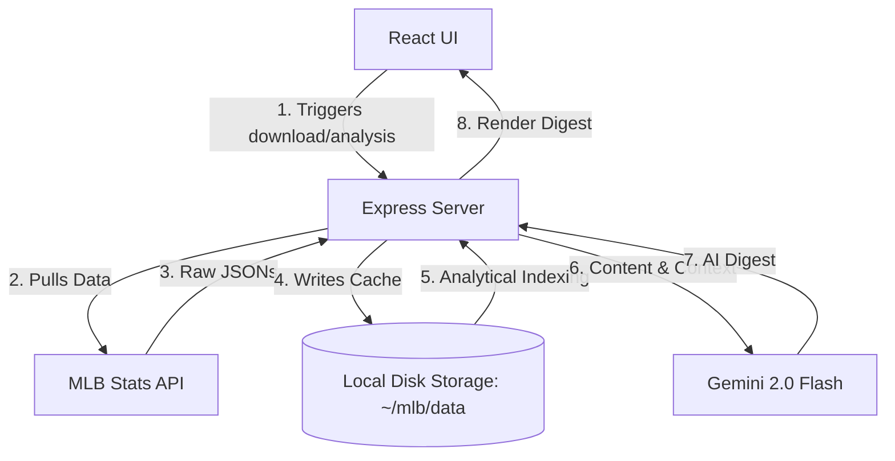

# MLB Fan Digest Creator ⚾️🤖

This project was built by **Niti Singhal** as a submission for the **[MLB next2025 Challenge Hackathon](https://next2025challenge.devpost.com/)**.

It is a web application that generates personalized, AI-powered digests for MLB fans. By selecting your favorite teams and players, specifying a date, and choosing a duration, the app utilizes the **Gemini 2.0 Flash** model to synthesize game data, news recaps, and video highlights into a clean, readable newsletter digest.

> [!NOTE]  
> This project was partially **vibe coded**, balancing fast-paced exploratory coding with structured layout design to deliver a working prototype within the hackathon timeframe.

---

## Features

- **Personalized Selections**: Select and manage your favorite MLB teams and players.
- **Local Data Caching**: Downloads and stores rosters, schedules, play-by-play logs, and editorial game content locally to prevent API rate-limiting issues and speed up generation.
- **Data Indexing & Analytics**: Runs offline analytical passes over raw JSON schedule/game content files to map teams to matches and convert HTML recaps to clean text summaries.
- **AI-Powered Digest Generation**: Uses Gemini to:
  - Generate a historical, narrative overview of the team's path leading up to the chosen digest period.
  - Automatically rank and pick the most representative image capturing the team's season narrative.
  - Summarize key play-by-play statistics, player performances, and critical highlights for games within the digest window.
- **Rich Media Support**: Displays generated digests alongside primary game photography, textual recaps, and direct video highlight links.

---

## How It Works (Technical Architecture)

The system is split into two primary components: a **Node.js Express Server** (Backend) and a **React Single-Page Application** (Frontend).



### 1. File-System Caching Layer
To prevent heavy network footprints and respect API rate limits, `server/db/db.js` acts as a document-based file-system cache under the user's home directory (`~/mlb/data`). 

### 2. Analytical Processing
- **Team Analysis (`server/api/analysis.js`)**: Scans 2024 season schedule JSONs, parses outcomes, home/away status, and scores, then builds a reverse index mapping team IDs to their full match schedules.
- **Game Analysis (`server/api/analysis.js`)**: Parses official MLB game-content records, cleans editorial HTML recaps into plain text, and indexes media/video highlight links (specifically MP4 playbacks).

### 3. LLM Orchestration (`server/llm/llm.js` & `server/api/digest.js`)
When a digest is generated:
1. The server gathers historical matches before the digest window, and matches *within* the window.
2. It calls **Gemini 2.0 Flash** (`gemini-2.0-flash-exp`) with a structured prompt containing the past game recaps to summarize the team's trajectory.
3. It asks Gemini to evaluate image titles of all previous games and return the index of the most representative image.
4. For games in the current digest window, it sends the clean-text recap to Gemini to extract notable player statistics, key moments, and metrics in clear Markdown bullet points.

---

## Getting Started

### Prerequisites

- [Node.js](https://nodejs.org/) (v18 or higher recommended)
- [Yarn](https://yarnpkg.com/) (v1.22 or higher)
- A **Gemini API Key** from [Google AI Studio](https://aistudio.google.com/)

---

### Local Setup Instructions

#### 1. Clone the repository
```bash
git clone https://github.com/your-username/mlb-hackathon.git
cd mlb-hackathon
```

#### 2. Start the Backend Server
First, configure your Gemini API Key in your environment:
```bash
export GEMINI_API_KEY="your_actual_gemini_api_key_here"
```

Then install dependencies and start the backend:
```bash
cd server
yarn install
yarn watch
```
The server will boot on `http://localhost:3000`.

#### 3. Start the Frontend UI
In a separate terminal window/tab:
```bash
cd ui
yarn install
yarn watch
```
The client app will be bundled by Parcel and served at `http://localhost:1234`.

---

## Step-by-Step Usage Flow

1. Open **`http://localhost:1234`** in your browser.
2. Go to the **Download** tab in the sidebar:
   - Click each button in sequence (Download Teams, Download Games, Download Content, etc.).
   - Wait for the confirmation toast after each action. This populates your local `~/mlb/data` cache.
3. Go to the **Teams** & **Players** tabs:
   - Search for your favorite teams/players and click **Add favorite**.
4. Go to the **Analyze** tab:
   - Click the analysis buttons to precompute schedules and clean recaps.
5. Go to **Digest** > **Create Digest**:
   - Choose a target Date (e.g., `2024-08-31`) and Duration (e.g., `Weekly`).
   - Click **Create Digest**.
   - After a minute or two of AI processing, you will be redirected to your custom digest showing a narrative recap, key game bullets, image spotlights, and video highlights.

---

## Building and Verification

### Static Type Checking (UI)
The React application is written in TypeScript. You can check for any type mismatches by running:
```bash
cd ui
yarn tsc
```

### Production Build
To generate production-ready static assets for the UI:
```bash
cd ui
yarn build
```
The production bundle will be output to the `ui/dist` folder.

---

## License

This project is licensed under the MIT License. See the [LICENSE](https://github.com/nsinghal12/mlb-hackathon/blob/main/LICENSE) file for details.

Copyright © 2025 Niti Singhal.
